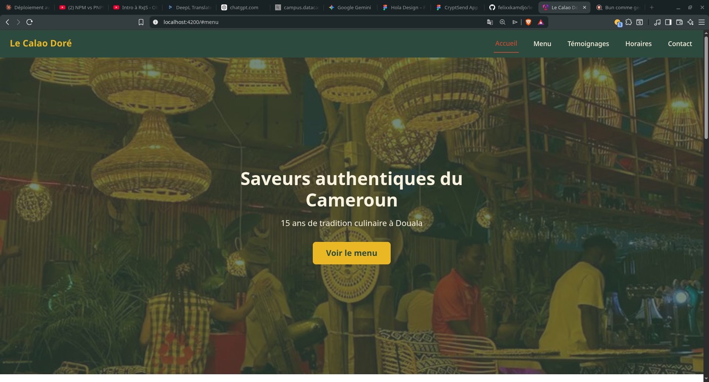
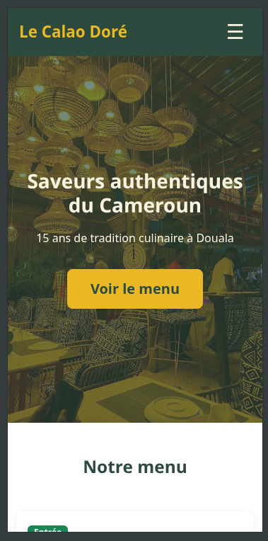

# Le Calao Doré - Restaurant Camerounais

> Site vitrine d'un restaurant traditionnel camerounais à Douala.
> Projet réalisé dans le cadre d'Angular Talent Lab 2026.

## Captures d'écran

### Desktop


### Mobile


## Technologies utilisées

- Angular 22.0.7
- Bootstrap 5.3.8
- TypeScript 6.0.3
- pnpm 11.7.0

## Fonctionnalités

- Layout responsive (Desktop/Tablette/Mobile)
- Menu burger mobile
- Carte interactive des plats avec catégories
- Témoignages clients avec étoiles dynamiques
- Horaires avec indicateur du jour ouvert
- Footer multi-colonnes

## Lancer le projet en local

```bash
git clone https://github.com/felixxkamdjo/le-calao-dore.git
cd le-calao-dore
pnpm install
pnpm start
```

Ouvrir [http://localhost:4200](http://localhost:4200).

## Auteur

KMD - Apprenant Angular Talent Lab 2026 - Cohorte Douala
